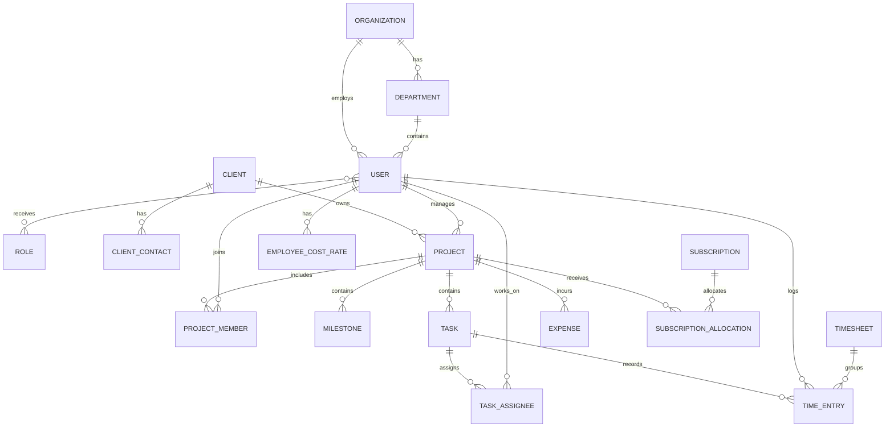

# Bytech Project Management System

## MVP Product Blueprint - v0.1

Status: Draft for review  
Company: Bytech  
Application type: Internal web application  
Default language: English (LTR)  
Secondary language: Arabic (RTL)  
Default timezone: Asia/Amman  
Provisional base currency: JOD (configurable)

## 1. Product goal

Build one internal system that allows Bytech to manage departments, employees, clients, projects, tasks, time, approvals, operating expenses, and project profitability.

The first release serves Bytech only. The data model will still contain one `Organization` record so that supporting additional companies later does not require redesigning all core tables.

## 2. MVP scope

The MVP includes:

- Authentication and user accounts.
- Departments, employees, roles, and granular permissions.
- Clients and client contacts.
- Projects, project managers, project teams, milestones, tasks, and subtasks.
- Automatic timer and manual time entries.
- Timesheet submission, rejection, approval, and locking.
- Calendar for tasks, milestones, timesheets, subscriptions, and expenses.
- Employee cost rates, project selling price, estimated cost, actual cost, profit, and margin.
- Monthly subscriptions and other expenses.
- Role-specific dashboards and basic reports.
- Notifications and an audit log for sensitive changes.

The MVP does not include:

- Operating-system activity monitoring or screenshots.
- Payroll processing or salary bank transfers.
- Full accounting/general-ledger functionality.
- Native mobile applications.
- Advanced client invoicing and payment reconciliation.

These can be added after the core web application is stable.

## 3. Users and permissions

Permissions must be role-based and scoped. A user can have an organization role and a different role inside each assigned project.

| Role | Primary access |
| --- | --- |
| Admin | Full system access, configuration, users, permissions, and audit log |
| Accountant | Salaries, employee cost rates, expenses, subscriptions, project financials, and reports |
| Project Manager | Projects they directly manage, their teams and tasks, project calendar, estimates, and time approvals |
| Employee | Assigned projects and tasks, own calendar, own timer, and own time entries |
| Client | Own projects, approved progress, milestones, files, comments, and deliverables only |

Permanent deletion of unused projects, tasks, employees, and client companies requires the Admin-only `records.delete` permission. Records connected to time or financial history must be archived or cancelled instead.

### Sensitive-data rules

- Employees cannot view salaries, cost rates, internal project costs, or other employees' activity.
- Project managers can view approved project-cost totals only when granted the `view_project_financials` permission.
- Project managers do not see employee salaries by default.
- Clients never see salaries, internal costs, profit margin, employee activity, or internal-only comments.
- Accountants cannot modify project tasks unless separately granted that permission.
- Every salary, cost-rate, approval, and financial change is recorded in the audit log.

## 4. Core modules

### 4.1 Organization and departments

- One active organization: Bytech.
- Departments with an optional department manager.
- Active and archived employees.
- Employment start/end dates and weekly capacity.

### 4.2 Clients

- Client company profile.
- Multiple contacts per client.
- Contact portal access can be enabled or disabled individually.
- One client can have multiple projects.

### 4.3 Projects

Each project contains:

- Client.
- Primary project manager and optional deputy.
- Pricing model: fixed price, time and materials, or monthly retainer.
- Contract value and currency.
- Start date, target date, status, and progress.
- Planned hours, planned cost, budget, and target margin.
- Assigned team members, project role, and allocation percentage.
- Milestones, tasks, files, comments, and activity history.

Project statuses:

`Draft -> Planned -> Active -> On Hold -> Completed -> Cancelled`

### 4.4 Tasks

Each task contains:

- Project and optional milestone.
- Title, description, status, priority, and tags.
- One primary assignee and optional contributors.
- Start date, due date, and original time estimate.
- Remaining estimate and actual approved time.
- Billable or non-billable classification.
- Dependencies, subtasks, comments, and attachments.

Default task workflow:

`Backlog -> To Do -> In Progress -> In Review -> Done`

### 4.5 Time tracking

Two entry sources are supported:

- Timer: the employee selects a project and task, then starts and stops the timer.
- Manual: the employee enters date, start/end time or duration, task, and a required note.

Validation rules:

- A user cannot run two timers at the same time.
- Overlapping time entries are rejected.
- Time cannot be logged to an archived project or closed task unless permission is granted.
- Manual entries retain their source and edit history.
- Approved entries cannot be edited until an authorized user unlocks them.

Timesheet workflow:

`Draft -> Submitted -> Approved / Rejected -> Locked`

- Employees submit timesheets weekly by default.
- The relevant project manager reviews the entries for projects they manage.
- Rejection requires a reason.
- Approval locks the included entries.
- Admin or an authorized accountant can unlock entries, with a mandatory reason.

### 4.6 Finance and profitability

Employee salary is confidential. Financial calculations use effective-dated employee cost rates so historical reports do not change after a salary update.

```text
Monthly employment cost
= salary + allowances + employer-paid benefits and overhead

Hourly internal cost
= monthly employment cost / planned productive hours per month

Planned labor cost
= sum(estimated task hours x assigned employee hourly cost)

Actual labor cost
= sum(approved time hours x effective employee hourly cost)

Total project cost
= labor cost + direct expenses + allocated subscriptions + allocated overhead

Profit
= recognized project revenue - total project cost

Margin percentage
= profit / recognized project revenue x 100
```

The project financial dashboard shows:

- Contract value.
- Planned, actual, and forecast cost.
- Planned versus approved hours.
- Direct and allocated expenses.
- Profit and margin percentage.
- Budget-consumption percentage.
- Warnings for budget or hour overruns.

### 4.7 Subscriptions and expenses

Subscriptions contain:

- Vendor, description, category, amount, currency, billing cycle, and due date.
- Start/end dates and renewal status.
- Company-wide or project-specific allocation.
- Receipt/invoice attachment and payment status.

Other expenses contain:

- Date, vendor, category, amount, tax, currency, and payment status.
- Optional client and project.
- Receipt attachment, submitter, approver, and approval status.

### 4.8 Dashboard and calendar

The home dashboard is role-specific:

- Admin: organization overview, active projects, overdue work, utilization, costs, and alerts.
- Accountant: upcoming subscriptions, pending expenses, project profitability, and missing cost data.
- Project Manager: project health, overdue tasks, team workload, and timesheets awaiting approval.
- Employee: today's tasks, active timer, deadlines, and unsubmitted time.
- Client: project progress, milestones, approved updates, and deliverables.

The calendar combines tasks, milestones, project deadlines, timesheet deadlines, subscriptions, and approved leave. It supports filters by employee, department, client, project, and event type.

## 5. Screen map

```text
Authentication
  Login
  Forgot password

Workspace
  Dashboard
  Calendar
  Notifications

People
  Departments
  Employees
  Roles & Permissions

Business
  Clients
  Projects
    Overview
    Tasks / Board
    Team
    Time
    Files & Comments
    Financials

Time
  My Timesheet
  Approvals

Finance
  Project Profitability
  Subscriptions
  Expenses
  Reports

Administration
  Company Settings
  Localization
  Audit Log
```

## 6. Core data relationships



## 7. Brand and localization rules

### Brand tokens

| Token | Value | UI use |
| --- | --- | --- |
| `brand-primary` | `#435266` | Navigation, primary buttons, headings |
| `brand-secondary` | `#EF7D00` | Accent, active state, emphasis |
| `brand-tertiary` | `#4997C2` | Information, charts, secondary accents |
| `neutral-black` | `#000000` | Primary text |
| `neutral-700` | `#5B5B5B` | Secondary text |
| `neutral-400` | `#A0A0A0` | Muted text and placeholders |
| `neutral-200` | `#DBDBDB` | Borders and dividers |
| `neutral-white` | `#FFFFFF` | Cards and surfaces |

- Typeface: Baloo Bhaijaan 2, using Regular, SemiBold, and Bold.
- English is the default locale and uses LTR layout.
- Arabic is optional per user and switches the full application to RTL.
- User language preference is saved in the profile.
- Dates, numbers, currencies, labels, notifications, validation messages, and reports are localized.
- Email addresses, codes, timer values, and identifiers preserve their correct direction inside RTL screens.
- Full logo minimum digital width: 150 px. Logomark minimum: 50 px.

## 8. Provisional operational defaults

These values remain configurable in Company Settings:

- Timezone: Asia/Amman.
- Base currency: JOD.
- Timesheet period: weekly.
- Workday capacity: 9 hours.
- Standard workweek: Sunday through Thursday.
- Weekly capacity for a full-time employee: 45 hours.
- Weekend: Friday and Saturday.
- Default authentication: company email and password.

## 9. Implementation sequence

1. Create the Next.js/TypeScript application and design system.
2. Add PostgreSQL, Prisma migrations, localization, and authentication.
3. Implement roles, permissions, departments, and employees.
4. Implement clients, projects, project members, milestones, and tasks.
5. Implement calendar, timer, manual entries, timesheets, and approvals.
6. Implement employee cost rates, expenses, subscriptions, and profitability.
7. Add dashboards, reports, notifications, audit logging, tests, and deployment controls.
8. Design the separate desktop activity agent after MVP acceptance.

## 10. MVP acceptance summary

The MVP is acceptable when Bytech can:

- Add employees, departments, clients, and projects with correct access restrictions.
- Assign project managers and employees to projects and tasks.
- Track time automatically or manually and complete the approval workflow.
- View all deadlines in a filtered calendar.
- Store confidential employee cost rates safely.
- Compare planned and actual hours and costs.
- Calculate project profit and margin from approved time and expenses.
- Track recurring subscriptions and other expenses.
- Use the full interface in English and switch to Arabic RTL.
- Trace sensitive changes through an audit log.
